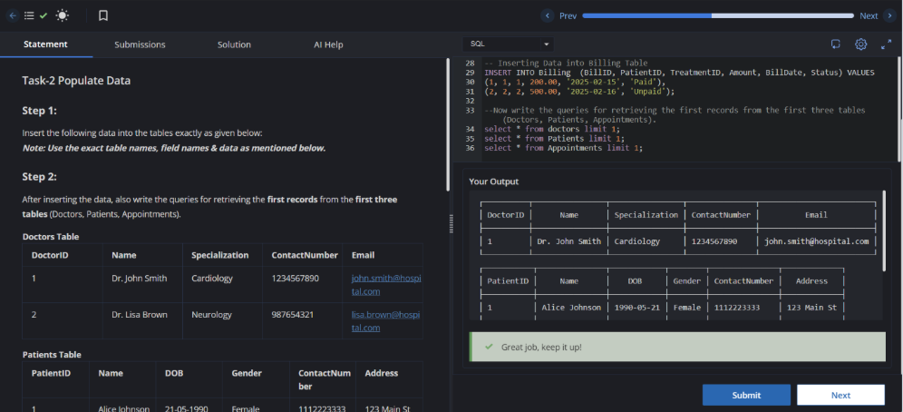

# Experiment 1

**Name:** Sonia   
**UID:** 24BCS12732

---

# Aim

To insert the given records into the hospital database tables and retrieve the first record from the first three tables.

---

# Question

### Step 1

Insert the following data into the tables exactly as provided below.

**Note:** Use the exact table names, field names, and data specified.

### Step 2

After inserting the data, write queries to retrieve the first records from the first three tables:

- Doctors
- Patients
- Appointments

---

## Doctors Table

| DoctorID | Name | Specialization | ContactNumber | Email |
|----------|----------------|----------------|---------------|----------------------------|
| 1 | Dr. John Smith | Cardiology | 1234567890 | john.smith@hospital.com |
| 2 | Dr. Lisa Brown | Neurology | 0987654321 | lisa.brown@hospital.com |

---

## Patients Table

| PatientID | Name | DOB | Gender | ContactNumber | Address |
|-----------|---------------|------------|--------|---------------|-------------|
| 1 | Alice Johnson | 1990-05-21 | Female | 1112223333 | 123 Main St |
| 2 | Bob Martin | 1985-08-14 | Male | 4445556666 | 456 Elm St |

---

## Appointments Table

| AppointmentID | PatientID | DoctorID | AppointmentDate | Status |
|---------------|-----------|----------|-----------------|-----------|
| 1 | 1 | 1 | 2025-02-15 | Scheduled |
| 2 | 2 | 2 | 2025-02-16 | Completed |

---

## Treatments Table

| TreatmentID | PatientID | DoctorID | Diagnosis | TreatmentDescription | TreatmentDate |
|-------------|-----------|----------|-----------|----------------------|---------------|
| 1 | 1 | 1 | Hypertension | Prescribed medication | 2025-02-15 |
| 2 | 2 | 2 | Migraine | MRI Scan and medications | 2025-02-16 |

---

## MedicalRecords Table

| RecordID | PatientID | TreatmentID | Notes |
|----------|-----------|-------------|----------------------------------------|
| 1 | 1 | 1 | Patient responding well to treatment |
| 2 | 2 | 2 | Further evaluation required |

---

## Billing Table

| BillID | PatientID | TreatmentID | Amount | BillDate | Status |
|--------|-----------|-------------|--------|------------|---------|
| 1 | 1 | 1 | 200.00 | 2025-02-15 | Paid |
| 2 | 2 | 2 | 500.00 | 2025-02-16 | Unpaid |

---

# SQL Queries Used

The complete SQL queries used for this experiment are available in the file:

📄 **[solution.sql](solution.sql)**

---

# Output

The output after executing the SQL queries is shown below.

---

# Result

The required data was inserted into all the specified tables, and the first records from the **Doctors**, **Patients**, and **Appointments** tables were retrieved successfully.
